<h1 align='center'>&nbsp;#내가_다녀온_동대문구</h1> 

## 목차
 - [개요](https://github.com/dllgkdud/pro3#-개요)
 - [사용자 인터페이스](https://github.com/dllgkdud/pro3#-사용자-인터페이스)
 - [기술 환경](https://github.com/dllgkdud/pro3#-기술-환경)
 - [프로젝트 설계](https://github.com/dllgkdud/pro3#-프로젝트-설계)

## 개요
코로나로 인해 축소된 관광산업의 홍보 및 주변 상업의 활성화를 위해 동대문구 문화관광 웹 애플리케이션 사이트를 주제로 구현했습니다. 
담당자 : 이하영

## 사용자 인터페이스

## 기술 환경
 - Language(Front) : `Html5`, `CSS3`, `Javascript`, `JQuery`
 - Language(Back) : `Java`, `Jsp`
 - Tool : `Eclipse`
 - DBMS : `MariaDB`
 - DBMS Model : `MVC Level 2`
 - Framework(front) : `Bootstrap 4`
 - Framework(back) : `Eclipse`
 - Security : `AES256`
 - Target : `Web Browser`
 - Server : `Tomcat 8`
 - Infra : `EC2`, `RDS`
 - Etc : `Git`

## 프로젝트 설계
### 1. 클래스 설계
    1-1. 메뉴설계도
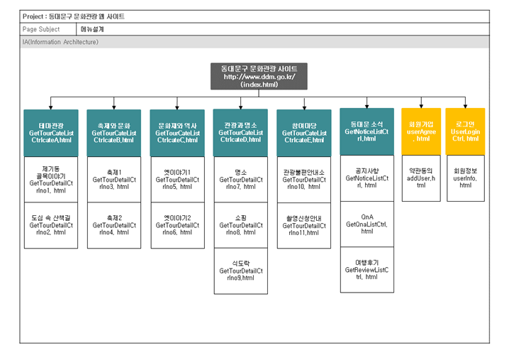

	1-2. Task Flow
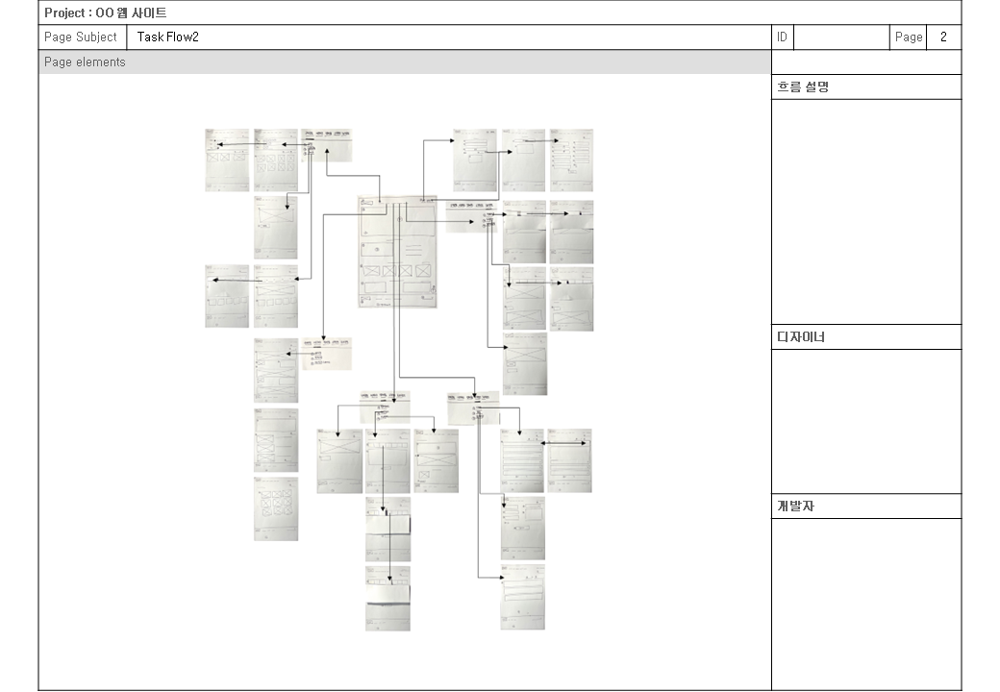

### 2. 화면 설계
	2-1. 스토리보드()

    
    2-2. UI 프로세스

	2-3. 스토리보드
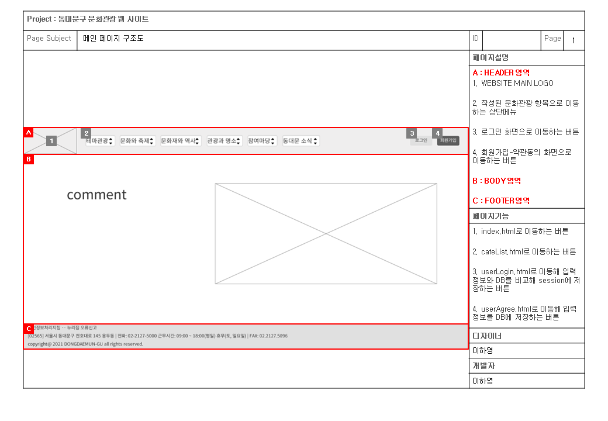
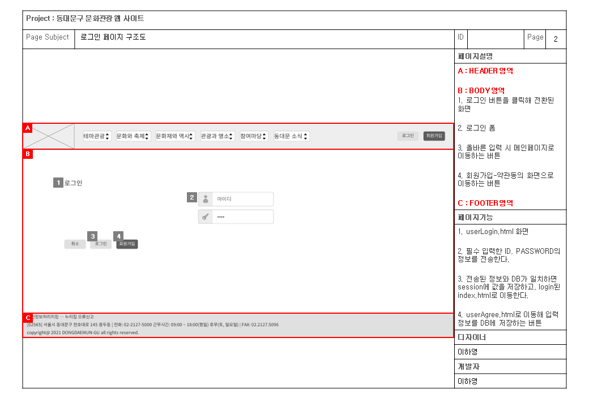
")
")
")

")
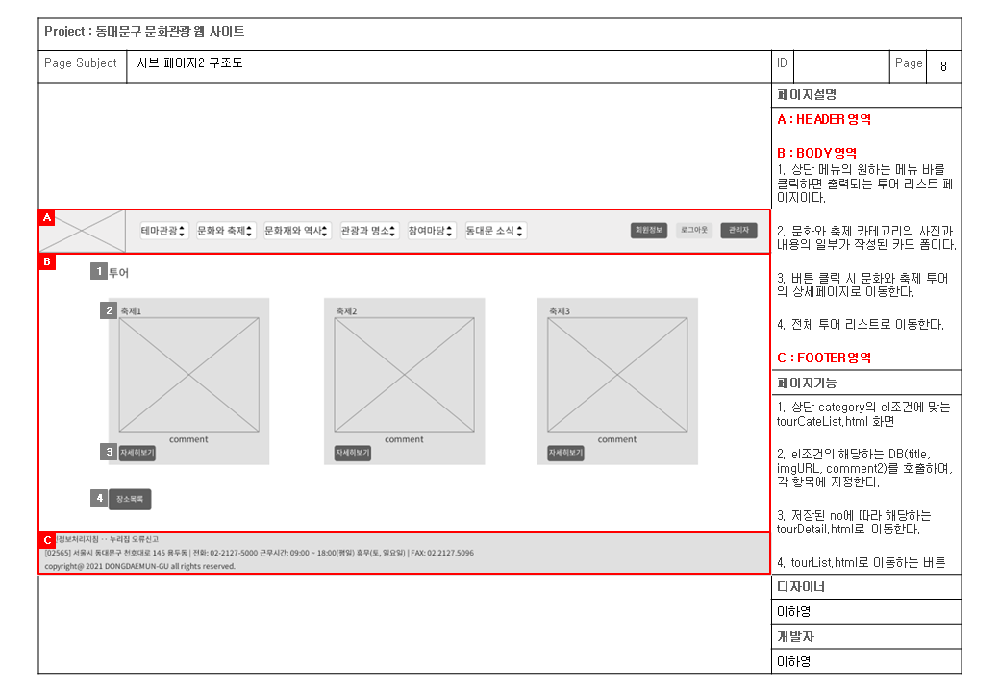
")

")
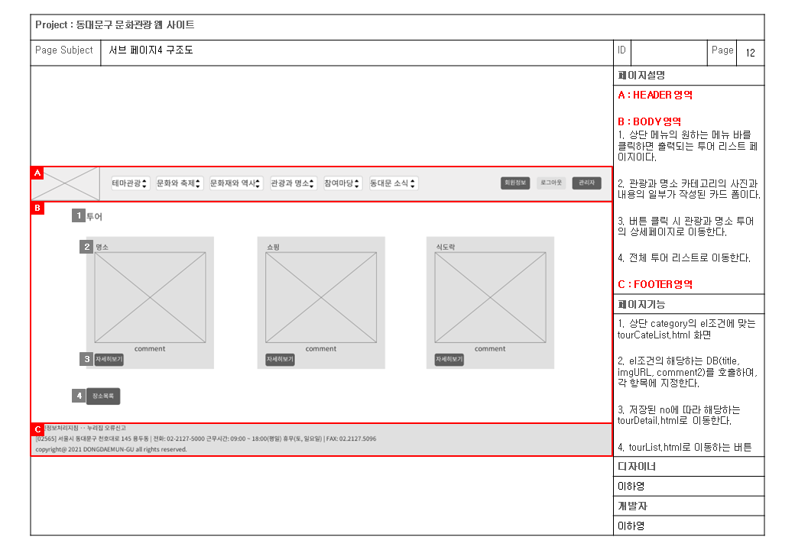
")
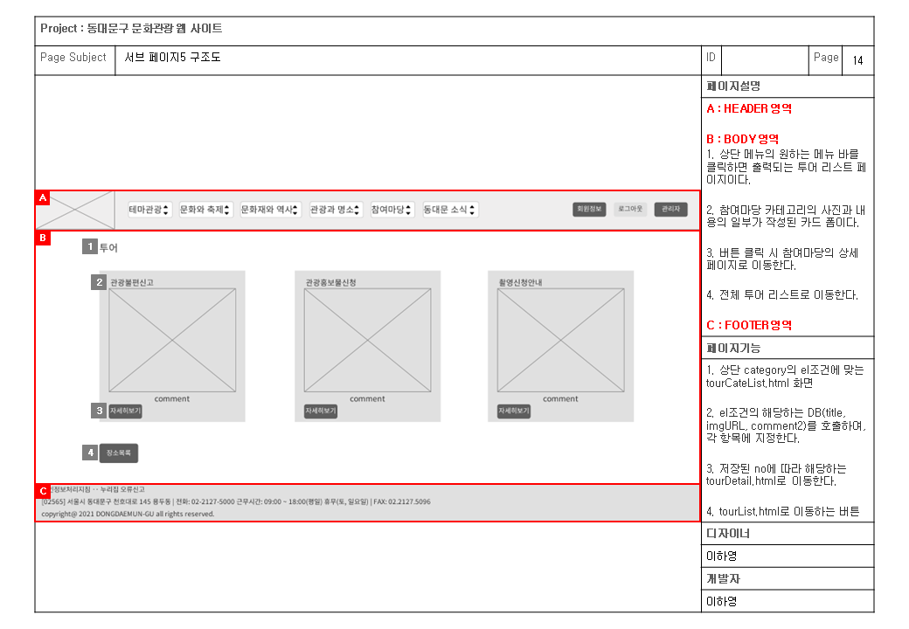
")
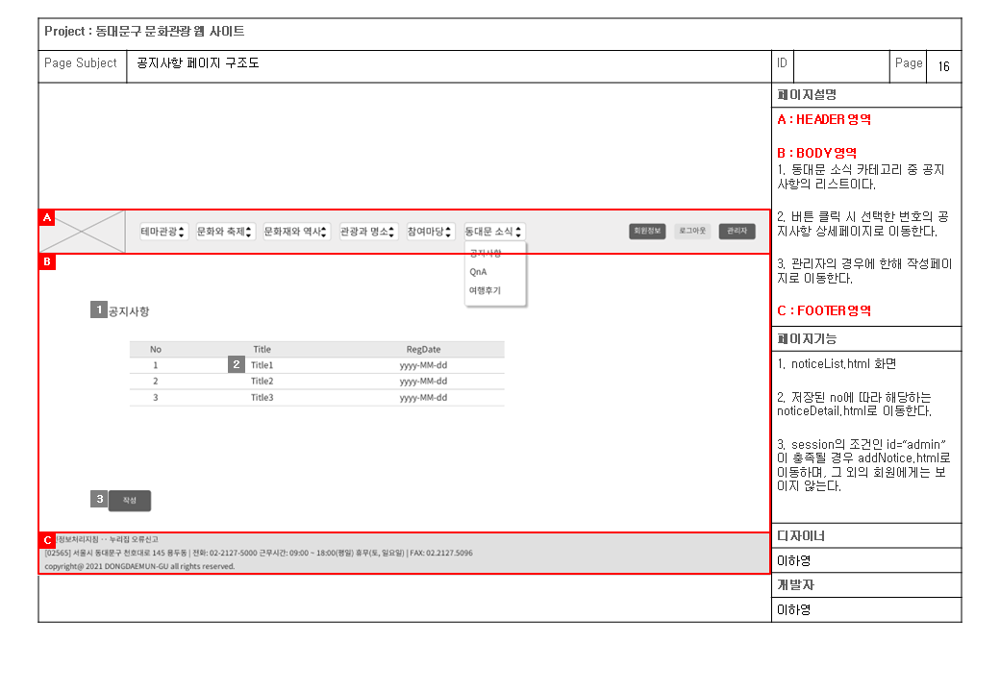
")

### 3. 기능 구현
	3-1. 기능 구현
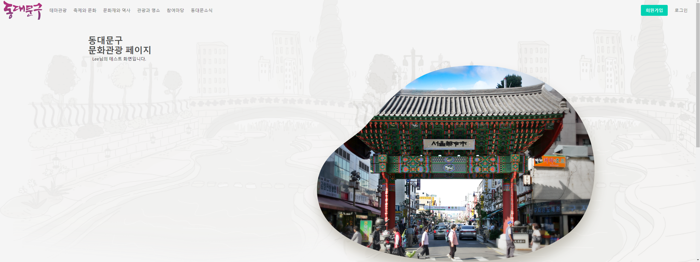
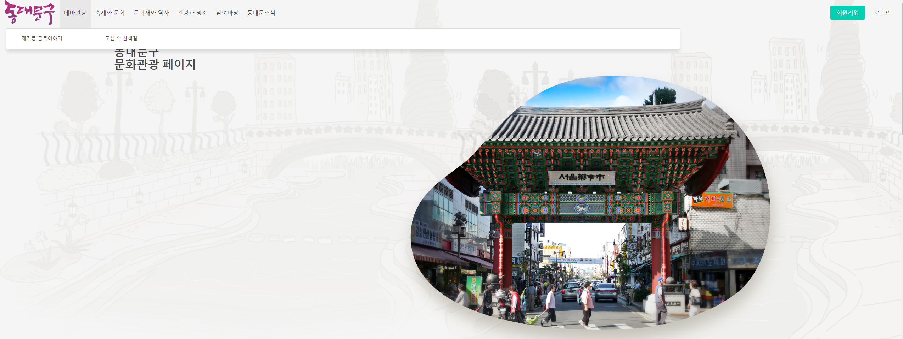
")
")
")
")
")
")
")
")
")
")
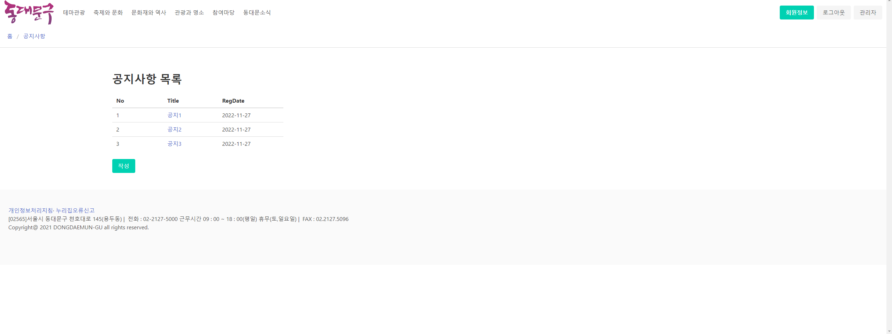
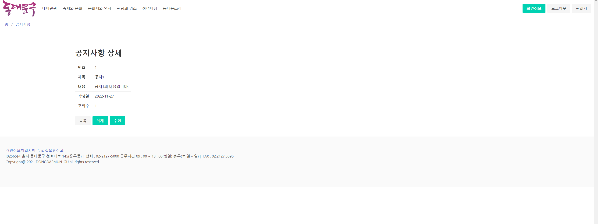
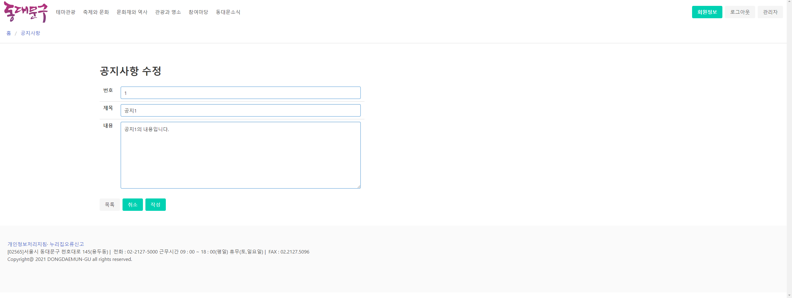
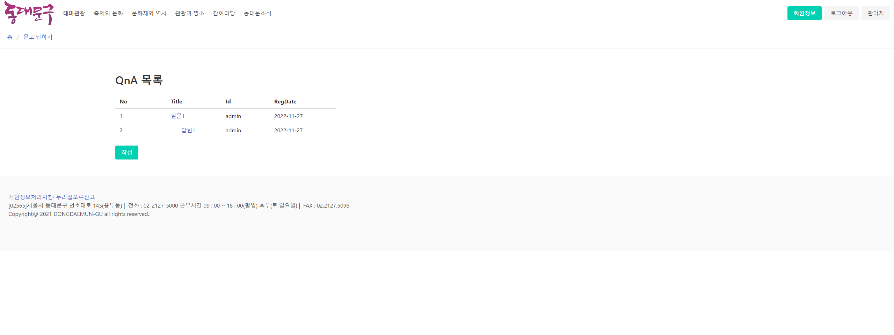
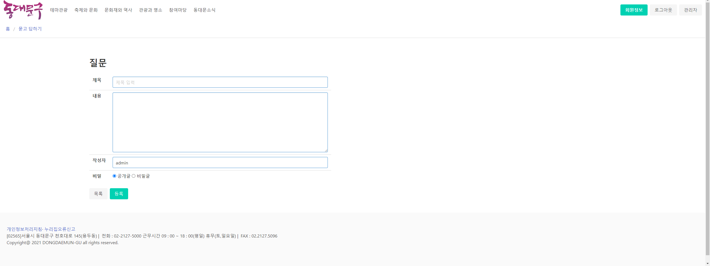
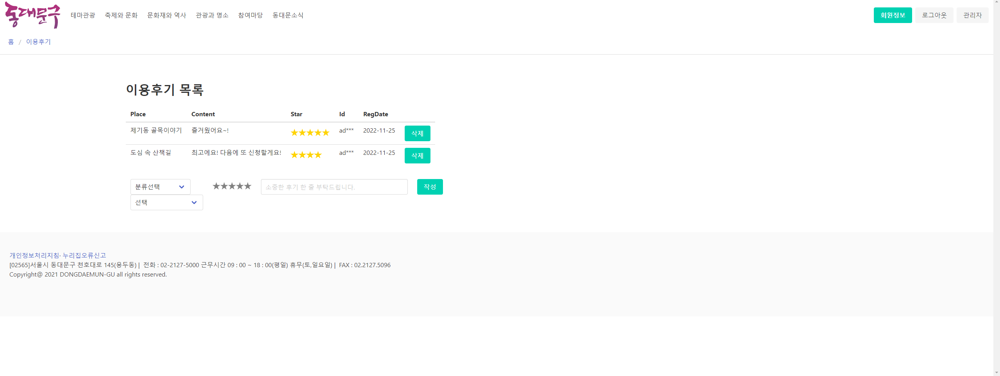
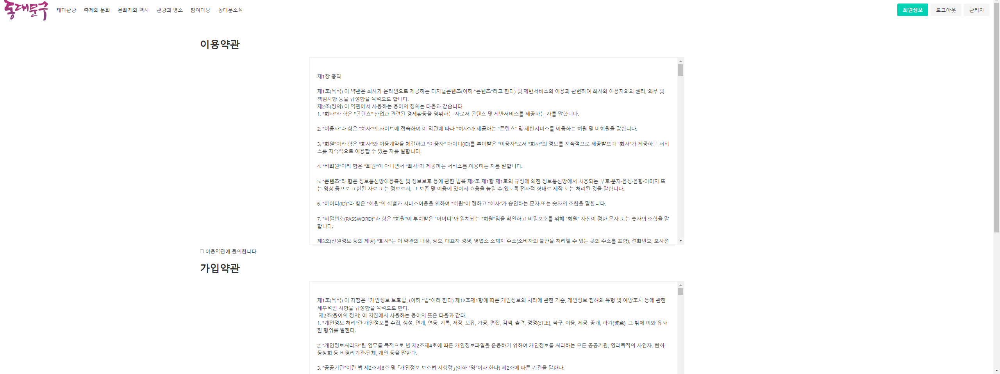
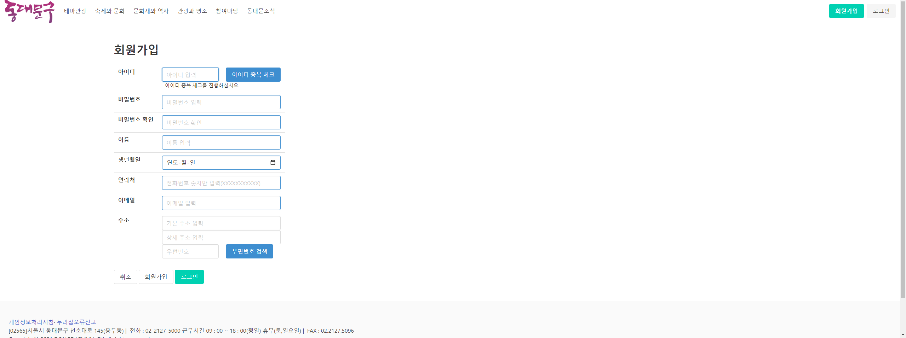
")
")
")
")
")
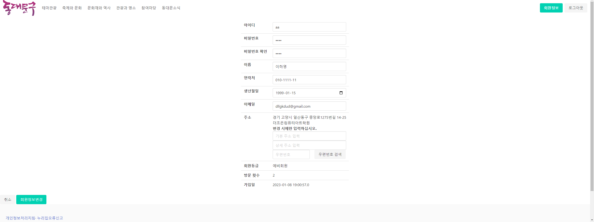
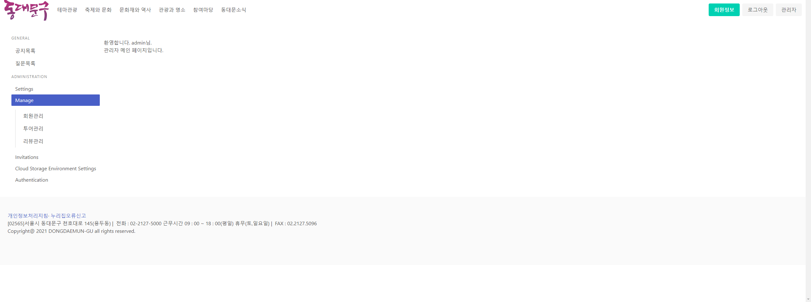
")
")
")
")
)")
)")
