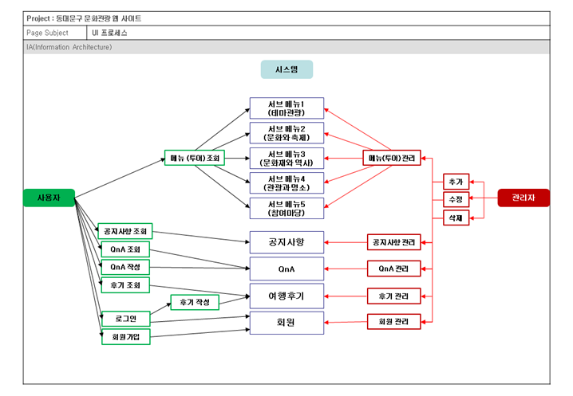
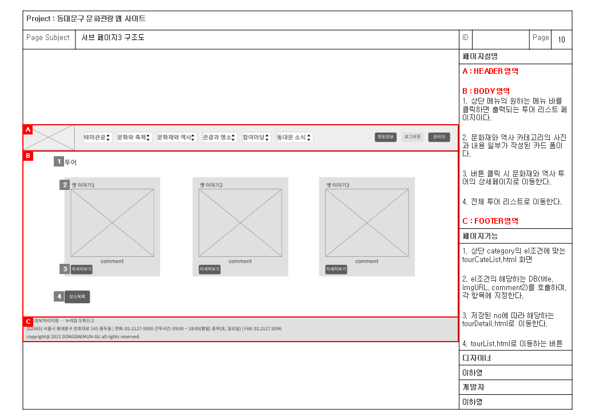

# 프로젝트 계획
## 동대문구 문화관광 웹 애플리케이션
    개요 : 동대문구의 관광지를 소개하고, 설명하기 위해 카테고리, 공지사항, 로그인, 회원가입, 등의 기능을 구현한 웹 애플리케이션이다.
    담당자 : 이하영

# 프로젝트 환경
1. 프론트엔드 언어 : html5, css3, javascript, jQuery
2. 백엔드 언어 : java, jsp
3. 에디터 : eclipse
4. 프론트엔드 프레임워크 : bootstrap 4
5. 백엔드 프레임워크 : eclipse
6. 암호화 방식 : aes256
7. DBMS : MariaDB
8. DBMS Model : MVC Level 2
9. Server : Tomcat 8

# 프로젝트 설계
### 1. 클래스 설계
    1-1. 메뉴설계도

	1-2. Task Flow

### 2. 화면 설계
	2-1. 스토리보드
")
    
    2-2. UI 프로세스

	2-3. 스토리보드

")
")
")

")

")

")

")

")

")

### 3. 기능 구현
	3-1. 기능 구현

")
")
")
")
")
")
")
")
")
")

")
")
")
")
")

")
")
")
")
)")
)")
